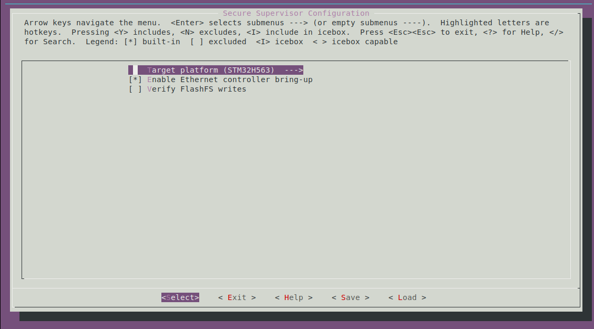
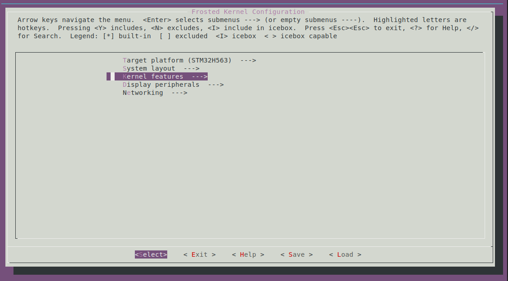
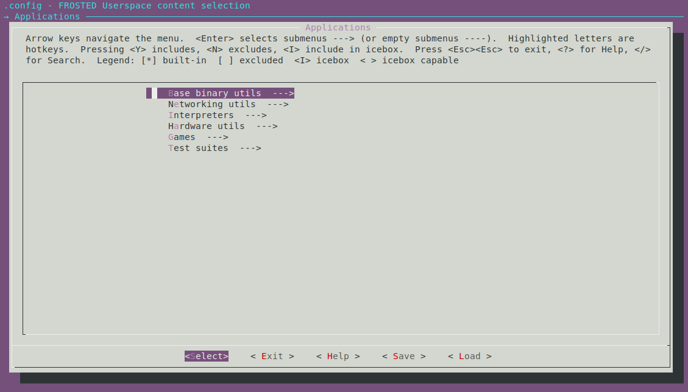

# FrostZone

Originally developed in 2015, Frosted OS began as a minimalist, open-source real-time operating system aimed at embedded platforms with a clean UNIX-like design and a focus on simplicity over bloat. It gained a following among hobbyists and systems developers for its modular kernel, small footprint and approachable codebase. While active development slowed as embedded systems evolved, Frosted remained a solid example of efficient, well-structured OS design. Now, ten years on, the project returns as **FrostZone**, revamped for modern ARMv8-M microcontrollers with a dual-kernel configuration and strengthened by TrustZone-based supervision.

## Goal

This project implements a small secure microkernel and a modular real-time operating system designed for ARMv8-M TrustZone-enabled microcontrollers. It aims to provide a POSIX compliant interfaces towards userspace, while keeping sandboxing and isolation between processes using MPU and TrustZone.

## Supported Hardware

FrostZone's primary development board is the **STM32H563 Nucleo-144** (MB1404). Both the secure supervisor and the non-secure Frosted kernel boot directly on this board with TrustZone isolation, Ethernet, USB (CDC + NCM) and XIPFS-backed userspace.

Legacy RP2350/Pico2 support is still available via the helper scripts, but new features land first on STM32H563.


## Architecture Overview

```
+-------------+      +--------------+                                                                
|             |      |              |                  - POSIX system calls                         
|   POSIX     |      |  POSIX       |                  - vfork, exec                                
|   thread    |      |  thread      |                  - XIP executables                            
+-----|-------+      +-----|--------+                  - micropython, TCP/IP pthreads       
      |                    |                                                                        
      |system call         | system call                                                            
      v                    v                                                                        
 +-----------------------------------------------+                                                  
 |   Frosted                                     |     - POSIX preemptive kernel with RT priorities
 |   preemptive scheduler                        |     - MPU based stack protection
 |    |                                          |     - TCP/IP sockets
 +----|------------------------------------------+                                                  
      |                                                                                             
      | nsc gateway                                                                                
      |                                                                                             
      v                                                                                             
 +-----------------------------------------------+                                                  
 |                                               |     - per-task limits + capabilities check 
 |Secure Microkernel                             |     - memory pool        
 |                                               |     - regulate access to peripherals             
 |                                               |     - crypto back-end, secure vault, ...
 +-----------------------------------------------+
```

## Memory layout (STM32H563)

* **Flash layout**:
  * `0x08000000 - 0x08003FFF`: Secure supervisor (16 KB)
  * `0x08004000 - 0x08007FFF`: Non-secure callable veneers (16 KB)
  * `0x08010000 - 0x0803FFFF`: Frosted kernel (192 KB)
  * `0x08040000 - ...      `: XIPFS volume (user apps + assets)

* **SRAM layout**:
  * `0x0BF90000 - 0x0BF93FFF`: Secure supervisor SRAM + mailbox (16 KB)
  * `0x20000000 - 0x20017FFF`: Frosted kernel RAM (96 KB)
  * `0x20040000 - ...      `: Secure-managed mempool for kalloc/kfree (512 KB)

### Memory layout (RP2350)

* **Flash layout**:
  * `0x10000000 - 0x10007FFF`: Secure supervisor (32 KB)
  * `0x10008000 - 0x1000FFFF`: Non-secure callables (32 KB)
  * `0x10010000 - 0x1002FFFF`: Frosted OS
  * `0x10030000 - ...       `: XIPFS (executable-in-place file system)  (1.8MB)

* **RAM layout**:

  * `0x20000000 - 0x2000FFFF`: Secure supervisor RAM
  * `0x20010000 - 0x2001FFFF`: Kernel RAM
  * `0x20040000 - ...       `: Memory pool managed in secure mode (384KB)

## Building and installing the kernels

Each component ships with its own Kconfig tree. Run `make menuconfig` inside `secure-supervisor/`, `frosted/` and `userland/` to tailor the supervisor, kernel and user apps before building.

* `cd secure-supervisor && make menuconfig` programs TrustZone options, secure memory layout and which NSC veneers are exposed. This is where you configure clocks, SAU/IDAU, secure stacks and the secure RNG/mailbox services.

* `cd frosted && make menuconfig` enables kernel subsystems such as networking, filesystems, USB, framebuffer and device drivers. You can also tweak scheduler options, stack sizes and build-time debug hooks.

* `cd userland && make menuconfig` selects which apps and libraries land in XIPFS. Enable shells, net utilities, demos or third-party payloads here so they are compiled into `userland/out/`.


Once `make menuconfig` is complete for the subdirectories, `make` from the repository root orchestrates this sequence automatically and produces the required `secure-supervisor/secure.bin` and `frosted/kernel.bin` images.


For STM32H563 builds, the root `Makefile` creates binaries for both domains. The most common flows are:

```
# Full build (secure + non-secure)
make

# Rebuild a specific component
make -C secure-supervisor
make -C frosted

# Flash the two kernels via ST-LINK
scripts/flash_all_stm32h5.sh --skip-userland
```

Current STM32 targets rely on the component Makefiles. Build the secure supervisor before the kernel:

```
make -C secure-supervisor clean all
make -C frosted clean all
```
## Building and installing userspace

Userland build requires a specific toolchain with the `arm-frosted-eabi` triplet.

You can build the toolchain from this repository:

[arm-frosted-eabi-gcc](https://github.com/danielinux/arm-frosted-eabi-gcc)

- Once the toolchain is installed, enter the userland directory and run `make menuconfig`.
- Select libraries and applications to be included in the final XIPFS image.
- Run `make` to build the userspace image.
- Run the script `scripts/flash_all_stm32h5.sh` to flash the entire system (including userland) to the connected device, via STLink.


## Current Status

**Secure world**

- STM32H563 supervisor configures SAU/IDAU, MPU and GTZC for strict TrustZone partitioning
- CMSE gateways expose allocation, task limits and privileged mempool services to the non-secure kernel
- Secure RNG, flash write path and mailbox services plumbed through the NSC veneer

**Non-secure Frosted kernel**

- POSIX-style scheduler with RT priorities, `vfork/exec`, signals, pipes, ptys, semaphores and task accounting
- XIPFS executable filesystem, flashfs `/var`, sysfs, memfs `/tmp` and a basic `/dev` tree
- WolfIP (<https://github.com/wolfSSL/wolfIP>) TCP/IP stack (DHCP, static config, sockets) with LAN8742 Ethernet driver and TinyUSB CDC/NCM device networking
- TrustZone-aware `kalloc`/`kfree`, MPU stack guards and privilege-only MMIO window enforced via GTZC
- Console over USB CDC + UART with framebuffer/fbcon optional

**Userspace**

- Support for TCP/IP on multiple interfaces (loopback, usb-ncm, ethernet).
- Minimal init and `fresh` shell, binary utils, net utils (`nc`, `ifconfig`, `dhcp`), filesystem tools, games and tests
- Toolchain (`arm-frosted-eabi`) produces PIC/XIP-friendly user binaries that run directly from XIPFS


## Roadmap

- Broaden userspace (busybox subset, sshd and Micropython refresh)
- Support for more devices & peripherals

## License

Supervisor code: GPLv3

Legacy Frosted Kernel: GPLv2
Including the following in-kernel libraries:
 * TinyUSB: MIT License (MIT)  Copyright (c) 2019 Ha Thach (tinyusb.org)
 * wolfIP: GPLv3 (wolfSSL Inc.)  Copyright (c) 2024 wolfSSL Inc.  All rights reserved.

## Copyright 

FrostZone RTOS kernel is a port of Frosted OS (c) 2015 insane-adding-machines
Cortex-M33 port (c) 2025 @danielinux

## Secure Design Notes

- Secure supervisor programs SAU/GTZC/MPU before dropping into the non-secure kernel, keeping TrustZone state confined to audited secure code (`secure-supervisor/include/stm32h563.h`).
- Frosted kernel runs non-secure but privileged; it alone drives MMIO via syscalls while the MPU marks the peripheral window as privileged-only.
- Userland tasks remain non-secure/unprivileged ELF/bFLT apps and rely on the kernel for device access; direct MMIO probes fault immediately.
- GTZC privilege registers are now programmed so every exposed peripheral demands privileged access (`GTZC1_TZSC_PRIVCFGR[1..3]`), matching the kernel’s privilege level.
- RCC stays non-secure visible for clock gating but the supervisor enables `RCC_PRIVCFGR` so only privileged code can reconfigure clocks.

## Userspace Guard Demo

- `userland/tests/tz_guard_demo.c` provides canned scenarios (`periph-read`, `periph-write`, `secure-ram` etc.) plus a manual `poke` helper to demonstrate fault behavior from user mode.
- `make -C userland` drops the binary into `userland/out/`; flash with `scripts/flash_all_stm32h5.sh`, connect to `ttyACM1` (115200 8N1) and run the scenarios to observe MPU/TZ traps versus allowed accesses.
- `scripts/run_tz_guard_demo.py` drives the same scenarios over `/dev/ttyACM1` and handles expected secure-fault resets for CI-style automation.
